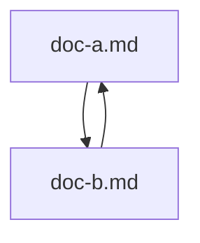

# ドキュメントA

これは **md-looks-good** 拡張機能の動作確認用サンプルです。日本語と English の混在テキストで読了時間の計算も確認できます。

~~この行は取り消し線のテストです。~~

## タスクリストの例

- [x] TOCパネルの実装
- [x] メタ情報パネルの実装
- [ ] アイコン画像の差し替え
- [ ] 追加のテーマプリセット検討

## GitHub/GitLabアラート記法

> [!NOTE]
> これはNoteアラートの例です。

> [!TIP]
> これはTipアラートの例です。

> [!IMPORTANT]
> これはImportantアラートの例です。

> [!WARNING]
> これはWarningアラートの例です。

> [!CAUTION]
> これはCautionアラートの例です。

## mkdocs(Material)のadmonition・その他記法

!!! tip "コツ"
    インデントされたブロックがそのまま本文になります。
    複数行にも対応しています。

!!! danger
    タイトル省略時は種別名がそのままタイトルになります。

これは==ハイライトされたテキスト==です。

++ctrl+alt+delete++ でタスクマネージャーを開けます。

## 概要

このドキュメントには [ドキュメントB](./doc-b.md) へのリンクがあります。開くとポップアップの有向グラフに両方のファイルとリンク関係が表示されるはずです。

## 使い方

1. `chrome://extensions` で「デベロッパーモード」を有効にする
2. 「パッケージ化されていない拡張機能を読み込む」から `dist/` を選択する
3. 拡張機能の詳細で「ファイルの URL へのアクセスを許可する」を有効にする
4. このファイルを Chrome で開く

## 機能一覧

- 左パネルの目次
- 右パネルのメタ情報(リンク集・注釈・太字・コード頻度)
- ページ内検索(`/` キーで起動)
- 配色のカスタム(オプションページから)
- 読了時間の推定表示

## コード例

インラインコードの頻度カウントを試すため、`npm install` を複数回登場させます。`npm install` の後は `npm run build` を実行してください。`npm run build` は esbuild を使います。

```bash
npm install
npm run build
```

## シンタックスハイライトとMermaidの例

```ts
interface Theme {
  backgroundColor: string;
}

function applyTheme(theme: Theme): void {
  console.log(theme.backgroundColor);
}
```



## 表の例

| 機能 | 対応状況 | 備考 |
| --- | --- | --- |
| 目次パネル | ✅ | Bartender.jsで開閉 |
| メタ情報パネル | ✅ | セクションごとに折りたたみ可能 |
| シンタックスハイライト | ✅ | highlight.js使用 |
| Mermaid | ✅ | ```mermaid ブロックで描画 |

## 注釈の例

これは脚注のテストです[^1]。複数の注釈も試します[^2]。

[^1]: 一つ目の注釈テキストです。
[^2]: 二つ目の注釈テキストです。

## まとめ

詳細は [ドキュメントB](./doc-b.md) を参照してください。また [GitHubのraw](https://raw.githubusercontent.com/octocat/Hello-World/master/README.md) ページの動作確認にも利用できます。
